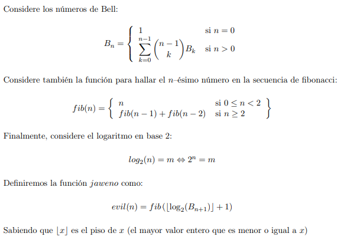

# Extra
Reto Extra
El problema implementado con el lenguaje de programación Python es el siguiente:

El reto se resolvió elaborando funciones para el cálculo de los números de Bell (función bell) y la sucesión de Fibonacci (función fibo). Ambas funciones pudieron ser implementadas con sus versiones recursivas, pero esto traería problemas incluso para los números más pequeños dada la naturaleza del problema. Por esto, se realizaron de manera iterativa y también se hizo uso de las funciones de Python: factorial,log2 y floor que se encuentran en la librería math.

## ¿Cómo correr el programa?

Este programa recibe los argumentos por medio de la consola. Por lo que al ejecutar el archivo retoExtra.py se debe incluir el número deseado al que se le desea aplicar la función evil. Ej:

    python retoExtra.py numero
    
 Además el programa puede evaluar los números hasta el 217, a partir del 218 como se trata de enteros muy grandes no se pueden realizar los cálculos.
